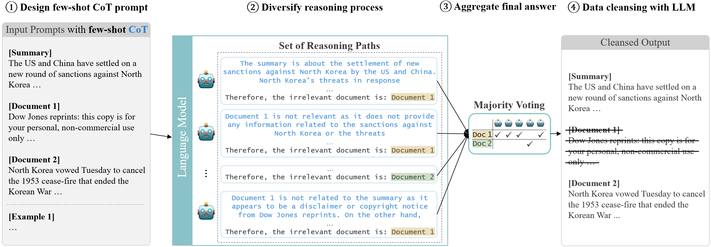

# Multi-News+: Cost-efficient Dataset Cleansing via LLM-based Data Annotation

## Introduction

This repository contains the source code for the paper ["Multi-News+: Cost-efficient Dataset Cleansing via LLM-based Data Annotation"](https://arxiv.org/pdf/2404.09682). We found that previous dataset contains noisy data, which can degrade the performance of the model. To address this issue, we propose a cost-efficient dataset cleansing method using a large language model (LLM), instead of human annotators. We demonstrate that our method can effectively cleanse the dataset by removing noisy data, which improves the performance of the model. Please refer to the paper for more details.



## Experiment

First, unzip two .tar.gz files in the `cleansing` directory. Then, run the following commands to install the required packages and execute the experiment.

```shell
$ conda create -n proj-multinewsplus python=3.8
$ conda activate proj-multinewsplus
$ pip install torch==1.13.1+cu116 torchvision==0.14.1+cu116 torchaudio==0.13.1 --extra-index-url https://download.pytorch.org/whl/cu116
$ pip install -r requirements.txt
$ bash run_experiment.sh
```

## Citation

```bibtex
@article{choi2024multi,
  title={Multi-News+: Cost-efficient Dataset Cleansing via LLM-based Data Annotation},
  author={Choi, Juhwan and Yun, Jungmin and Jin, Kyohoon and Kim, YoungBin},
  journal={arXiv preprint arXiv:2404.09682},
  year={2024}
}
```
